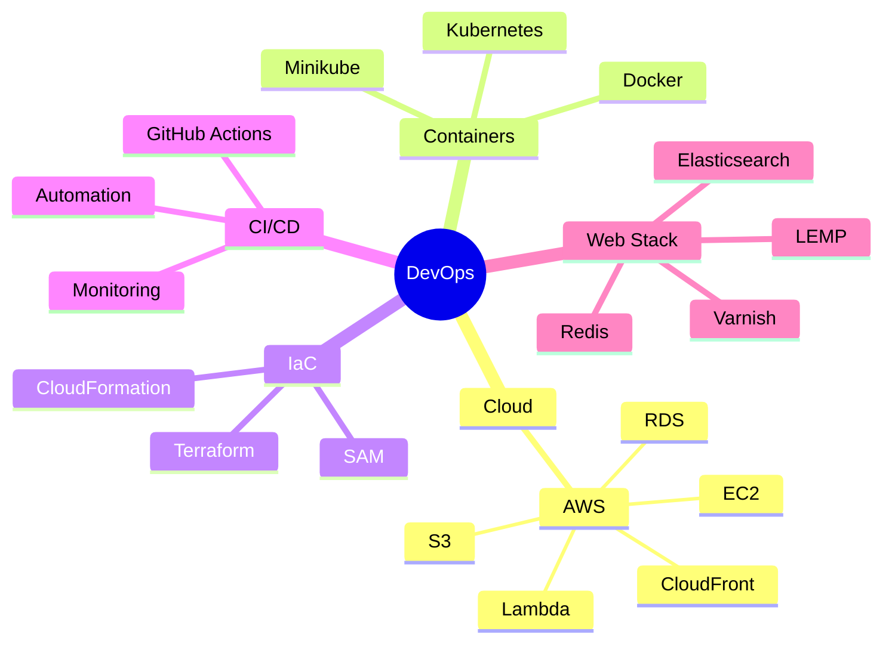

```ascii
  ╔══════════════════════════════════════════════════════════════════════════════╗
  ║                                                                              ║
  ║                           ⚡ M I N H A J   S ⚡                              ║
  ║                     DevOps & Cloud Infrastructure Engineer                   ║
  ║                                                                              ║
  ╚══════════════════════════════════════════════════════════════════════════════╝
```

<div align="center">
  
[](https://git.io/typing-svg)


</div>


## 🎯 About Me
```yaml
name: Minhaj S
located_in: Wayanad, Kerala, India
current_role: DevOps Engineer
technical_background:
  - Cloud Infrastructure Automation
  - CI/CD Implementation
  - Infrastructure as Code
  - Container Orchestration
education: 
  - BSc in Data Science & AI (IIT Madras)
  - BA in English (Kannur University)
```

<div align="center">
  
## 💫 Tech Universe

</div>



<div align="center">

## 🚀 Featured Projects

</div>

<details>
<summary>🌟 AWS Infrastructure Automation</summary>

```plaintext
│── Project Overview
│   ├── Multi-resource AWS deployment
│   ├── EC2 & RDS configuration
│   └── 50% reduction in setup time
│
│── Technologies
│   ├── AWS
│   ├── Terraform
│   ├── CloudFormation
│   └── IAM
```
</details>

<details>
<summary>🔄 Kubernetes Orchestration</summary>

```plaintext
│── Implementation
│   ├── Blue-green deployment
│   ├── Custom ingress controllers
│   └── Traffic management (75-25)
│
│── Stack
│   ├── Kubernetes
│   ├── Docker
│   ├── Terraform
│   └── Nginx Ingress
```
</details>

<details>
<summary>📊 Monitoring System</summary>

```plaintext
│── Features
│   ├── RAM monitoring
│   ├── Slack integration
│   └── Automated alerts
│
│── Tools
│   ├── Bash
│   ├── Cron
│   ├── Slack API
│   └── SystemD
```
</details>

<div align="center">

## 🌐 Connect With Me

<a href="https://www.linkedin.com/in/minhajms" target="_blank"></a>
<a href="https://github.com/Minhajms" target="_blank"></a>
<a href="https://medium.com/@minhajminnu580" target="_blank"></a>

</div>

<div align="center">

## 📈 GitHub Analytics

<p align="center">
<a href="https://github.com/Minhajms">
  
  
</a>
</p>

</div>

---

<div align="center">

### 📫 Reach out to me: minhajoutflow@gmail.com


```bash
~ $ while true; do echo "Happy Coding! 👨‍💻"; done
```

</div>
